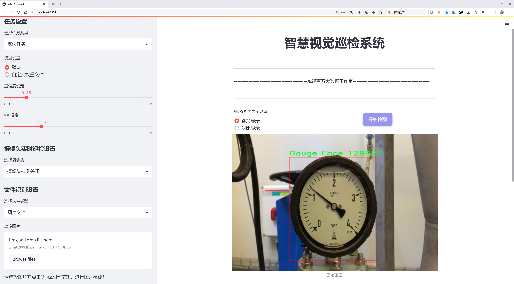
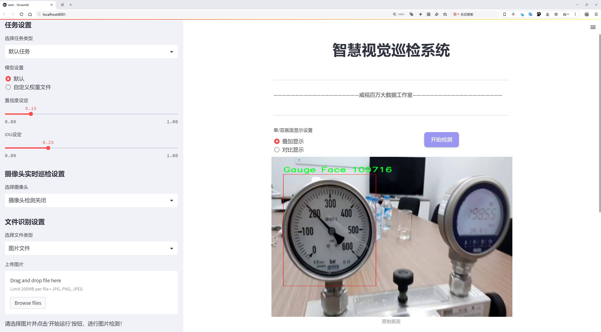
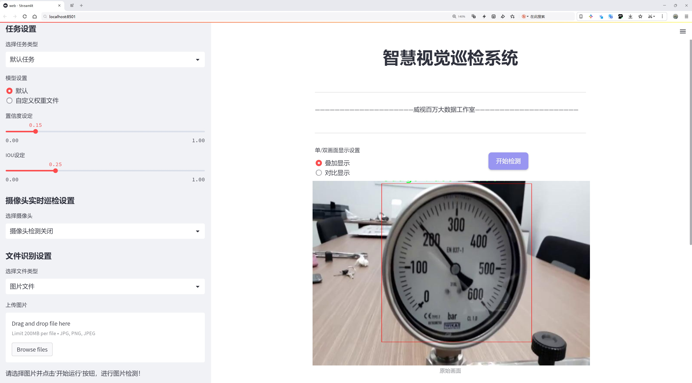
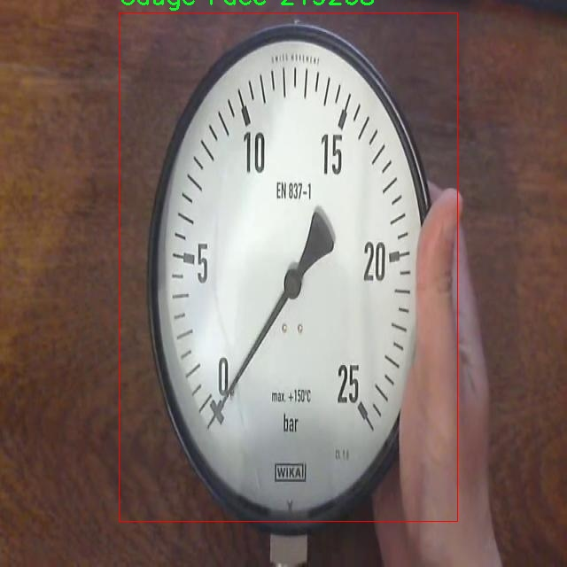
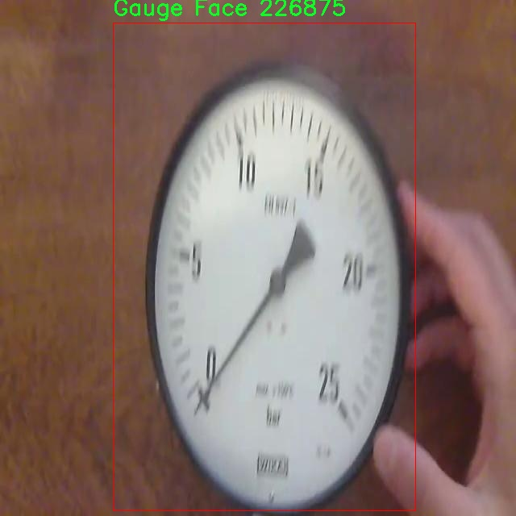
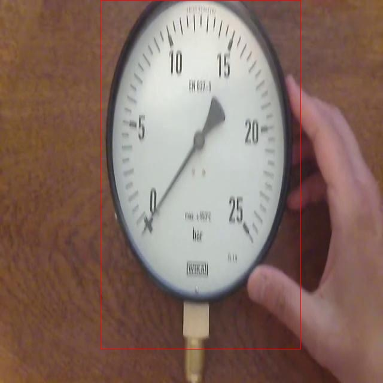
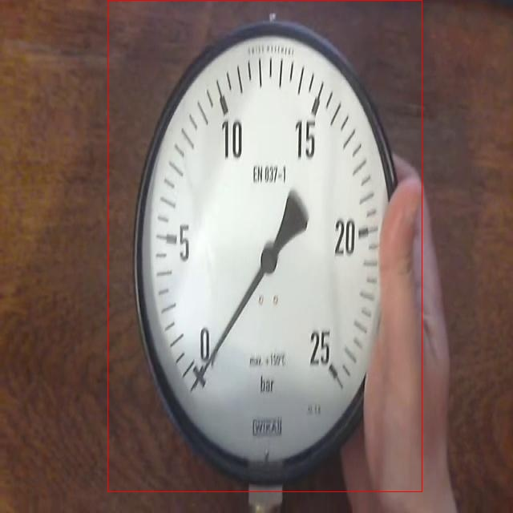
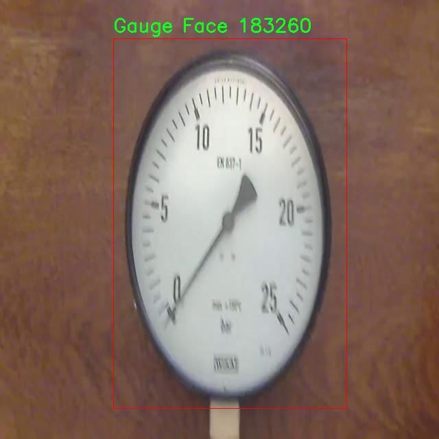

# 仪表盘检测检测系统源码分享
 # [一条龙教学YOLOV8标注好的数据集一键训练_70+全套改进创新点发刊_Web前端展示]

### 1.研究背景与意义

项目参考[AAAI Association for the Advancement of Artificial Intelligence](https://gitee.com/qunshansj/projects)

项目来源[AACV Association for the Advancement of Computer Vision](https://gitee.com/qunmasj/projects)

研究背景与意义

随着智能交通和自动化技术的迅速发展，仪表盘作为车辆信息显示的重要组成部分，其检测与识别的精确性直接影响到驾驶安全和用户体验。传统的仪表盘检测方法往往依赖于复杂的图像处理算法，难以适应多变的环境和复杂的仪表盘设计。因此，基于深度学习的目标检测技术逐渐成为研究的热点，其中YOLO（You Only Look Once）系列模型因其高效性和实时性受到广泛关注。YOLOv8作为该系列的最新版本，结合了多种先进的网络结构和优化策略，展现出更强的特征提取能力和检测精度。然而，针对特定领域如仪表盘检测的应用，仍然存在许多挑战和改进空间。

本研究旨在基于改进的YOLOv8模型，构建一个高效的仪表盘检测系统。我们所使用的数据集包含4100张图像，专注于仪表盘的表盘面（Gauge Face）这一单一类别。这一数据集的构建不仅为模型训练提供了丰富的样本，也为后续的模型评估和性能提升奠定了基础。通过对该数据集的深入分析，我们可以更好地理解仪表盘的多样性和复杂性，从而为模型的改进提供数据支持。

在研究意义上，首先，基于YOLOv8的仪表盘检测系统将为智能驾驶、车载信息系统等领域提供技术支持。随着自动驾驶技术的不断推进，实时、准确的仪表盘信息识别将成为提升驾驶安全性和用户体验的关键因素。其次，本研究通过对YOLOv8模型的改进，探索其在特定应用场景下的适应性和性能优化，为后续相关研究提供借鉴和参考。此外，仪表盘检测的成功实施也将推动其他领域的目标检测研究，尤其是在特定类别物体检测方面，促进深度学习技术的进一步应用和发展。

最后，随着数据集的不断扩展和模型的持续优化，未来的研究将能够实现更高精度的仪表盘检测，进而推动智能交通系统的智能化和自动化进程。通过对改进YOLOv8模型的深入研究，我们期望能够在提升检测准确率的同时，降低计算复杂度，使得该系统能够在资源受限的环境中也能高效运行。这不仅具有重要的学术价值，也为实际应用提供了切实可行的解决方案。因此，本研究在理论和实践层面均具有重要的意义，期待能够为仪表盘检测领域的发展贡献一份力量。

### 2.图片演示







##### 注意：由于此博客编辑较早，上面“2.图片演示”和“3.视频演示”展示的系统图片或者视频可能为老版本，新版本在老版本的基础上升级如下：（实际效果以升级的新版本为准）

  （1）适配了YOLOV8的“目标检测”模型和“实例分割”模型，通过加载相应的权重（.pt）文件即可自适应加载模型。

  （2）支持“图片识别”、“视频识别”、“摄像头实时识别”三种识别模式。

  （3）支持“图片识别”、“视频识别”、“摄像头实时识别”三种识别结果保存导出，解决手动导出（容易卡顿出现爆内存）存在的问题，识别完自动保存结果并导出到tempDir中。

  （4）支持Web前端系统中的标题、背景图等自定义修改，后面提供修改教程。

  另外本项目提供训练的数据集和训练教程,暂不提供权重文件（best.pt）,需要您按照教程进行训练后实现图片演示和Web前端界面演示的效果。

### 3.视频演示

[3.1 视频演示](https://www.bilibili.com/video/BV1KLtaecEmq/)

### 4.数据集信息展示

##### 4.1 本项目数据集详细数据（类别数＆类别名）

nc: 1
names: ['Gauge Face']


##### 4.2 本项目数据集信息介绍

数据集信息展示

在本研究中，我们使用的数据集名为“Gauge detection”，旨在为改进YOLOv8的仪表盘检测系统提供支持。该数据集专注于仪表盘中表盘的检测，特别是“Gauge Face”这一类别。数据集的类别数量为1，反映了我们对特定目标的高度关注和深度挖掘的需求。通过集中资源于这一单一类别，我们能够更好地优化模型的性能，提高其在实际应用中的准确性和可靠性。

“Gauge detection”数据集的构建过程经过精心设计，确保了数据的多样性和代表性。数据集中包含了大量的仪表盘图像，这些图像来自不同类型的车辆和设备，涵盖了各种不同的表盘设计、颜色和布局。这种多样性使得模型在训练过程中能够学习到更广泛的特征，从而在面对不同场景时表现出更强的适应能力。每一张图像都经过精确标注，确保了“Gauge Face”这一类别的准确定位，标注信息的准确性直接影响到模型的训练效果和最终的检测性能。

为了进一步增强数据集的实用性，我们还对图像进行了多种数据增强处理。这些处理包括旋转、缩放、翻转以及亮度和对比度的调整等。这些技术不仅增加了数据集的样本数量，还提高了模型的鲁棒性，使其能够在不同的光照条件和视角下有效地识别仪表盘。通过这种方式，我们希望能够模拟真实世界中可能遇到的各种情况，确保模型在实际应用中能够保持高效的检测能力。

在数据集的构建过程中，我们还特别关注了数据的质量。所有图像均来自高分辨率的摄像设备，确保了细节的清晰可辨。这对于仪表盘的检测尤为重要，因为表盘上的指针、刻度和其他细节特征都是模型进行准确判断的关键。我们还进行了数据清洗，剔除了模糊、失焦或不符合要求的图像，以保证训练数据的高质量。

此外，数据集的设计也考虑到了模型训练的平衡性。虽然目前仅有一个类别，但我们确保在数据集中包含了足够多的样本，以便模型能够充分学习到“Gauge Face”的特征。这种平衡性对于避免模型过拟合至关重要，能够使其在未见数据上的表现更加稳健。

总之，“Gauge detection”数据集的构建旨在为改进YOLOv8的仪表盘检测系统提供一个高质量、高代表性的训练基础。通过对数据集的精心设计和多样化处理，我们期望能够提升模型的检测精度和实用性，为未来的智能驾驶和自动化系统的发展贡献力量。随着研究的深入，我们相信这一数据集将为仪表盘检测领域带来新的突破和进展。











### 5.全套项目环境部署视频教程（零基础手把手教学）

[5.1 环境部署教程链接（零基础手把手教学）](https://www.ixigua.com/7404473917358506534?logTag=c807d0cbc21c0ef59de5)


[5.2 安装Python虚拟环境创建和依赖库安装视频教程链接（零基础手把手教学）](https://www.ixigua.com/7404474678003106304?logTag=1f1041108cd1f708b01a)

### 6.手把手YOLOV8训练视频教程（零基础小白有手就能学会）

[6.1 手把手YOLOV8训练视频教程（零基础小白有手就能学会）](https://www.ixigua.com/7404477157818401292?logTag=d31a2dfd1983c9668658)

### 7.70+种全套YOLOV8创新点代码加载调参视频教程（一键加载写好的改进模型的配置文件）

[7.1 70+种全套YOLOV8创新点代码加载调参视频教程（一键加载写好的改进模型的配置文件）](https://www.ixigua.com/7404478314661806627?logTag=29066f8288e3f4eea3a4)

### 8.70+种全套YOLOV8创新点原理讲解（非科班也可以轻松写刊发刊，V10版本正在科研待更新）

由于篇幅限制，每个创新点的具体原理讲解就不一一展开，具体见下列网址中的创新点对应子项目的技术原理博客网址【Blog】：


[8.1 70+种全套YOLOV8创新点原理讲解链接](https://gitee.com/qunmasj/good)

### 9.系统功能展示（检测对象为举例，实际内容以本项目数据集为准）

图9.1.系统支持检测结果表格显示

  图9.2.系统支持置信度和IOU阈值手动调节

  图9.3.系统支持自定义加载权重文件best.pt(需要你通过步骤5中训练获得)

  图9.4.系统支持摄像头实时识别

  图9.5.系统支持图片识别

  图9.6.系统支持视频识别

  图9.7.系统支持识别结果文件自动保存

  图9.8.系统支持Excel导出检测结果数据


### 10.原始YOLOV8算法原理

原始YOLOv8算法原理

YOLOv8作为YOLO系列的最新版本，标志着目标检测技术的又一次重要进步。其设计理念依然秉承了YOLO系列的核心思想，即在保持高检测精度的同时，实现快速的实时检测。YOLOv8的架构主要由输入层、主干网络、颈部网络和头部网络组成，这些组件相互协作，共同实现对输入图像的高效处理和目标检测。

在YOLOv8中，输入图像首先被缩放到指定的尺寸，以适应网络的输入要求。接下来，主干网络负责通过卷积操作对图像进行下采样，从而提取出丰富的特征信息。主干网络采用了CSPDarknet结构，利用多个残差块进行特征提取，相较于前代模型YOLOv5，YOLOv8引入了C2f模块替代了C3模块。C2f模块的设计灵感来源于YOLOv7中的E-ELAN结构，它通过跨层分支连接的方式增强了模型的梯度流，从而提高了特征提取的效果。具体而言，C2f模块将输入特征图分为两个分支，分别经过卷积层进行降维处理，随后将各个分支的输出进行堆叠，形成更高维度的特征图。这种设计不仅提升了特征图的表达能力，还有效地增强了模型的梯度流信息。

在主干网络的末尾，YOLOv8引入了快速空间金字塔池化（SPPF）结构。该结构通过三个最大池化层处理多尺度特征，进一步增强了网络的特征抽象能力。SPPF的使用不仅提升了特征提取的效率，还在一定程度上减少了模型的参数量和计算量，使得YOLOv8在资源受限的环境中依然能够保持高效的性能。

颈部网络则采用了特征金字塔网络（FPN）和路径聚合网络（PAN）的结合结构，旨在融合不同尺度的特征图信息。这一结构通过多个卷积层和池化层对特征图进行处理和压缩，确保在特征融合的过程中保留重要的信息，从而为后续的目标检测提供更加全面的特征支持。

在目标检测的实现上，YOLOv8采用了一种无锚框（Anchor-Free）的检测方式。这种方法直接预测目标的中心点及其宽高比例，省去了传统锚框设计的复杂性。无锚框的策略不仅减少了Anchor框的数量，还显著提高了检测速度和准确度。此外，YOLOv8还引入了任务对齐学习（TAL）机制，以更好地区分正负样本。TAL通过引入分类分数和IOU的高次幂乘积作为衡量任务对齐程度的指标，旨在同时优化定位和分类的性能。

YOLOv8的头部网络采用了解耦的检测头设计，具体而言，网络通过两个并行的卷积分支分别计算回归和类别的损失。这种设计使得分类任务与定位任务能够独立优化，分别关注特征图中提取到的特征与已知类别的相似性，以及边界框与真实框的位置关系。通过这种方式，YOLOv8在收敛速度和预测精度上均有所提升。

值得注意的是，YOLOv8在训练过程中对数据增强策略进行了调整，特别是在最后10个epoch中停止使用Mosaic数据增强。这一决策是基于对数据真实分布的考量，旨在避免模型学习到不良信息，从而提升模型的鲁棒性和泛化能力。

在性能上，YOLOv8展现出了优越的检测效果。根据官方在COCO数据集上的实验结果，YOLOv8在同尺寸模型中参数量没有显著增加的情况下，取得了更高的精度。同时，YOLOv8在推理速度上也表现出色，能够在保证检测准确度的前提下，实现更快的实时检测。这使得YOLOv8在诸如机器人垃圾分拣等需要兼顾实时性和准确性的应用场景中，展现出了极大的研究和应用价值。

总的来说，YOLOv8通过引入先进的网络结构和优化策略，成功地提升了目标检测的性能和效率。其无锚框的检测方式、解耦的检测头设计以及改进的特征提取模块，使得YOLOv8在目标检测领域树立了新的标杆。随着YOLOv8的不断发展和应用，其在实际场景中的表现将进一步推动目标检测技术的进步，为相关领域的研究和应用提供更多可能性。


### 11.项目核心源码讲解（再也不用担心看不懂代码逻辑）

#### 11.1 code\ultralytics\trackers\__init__.py

以下是对给定代码的核心部分进行分析和详细注释的结果：

```python
# Ultralytics YOLO 🚀, AGPL-3.0 license

# 从当前包中导入 BOTSORT 类
from .bot_sort import BOTSORT

# 从当前包中导入 BYTETracker 类
from .byte_tracker import BYTETracker

# 从当前包中导入 register_tracker 函数
from .track import register_tracker

# 定义模块的公共接口，允许用户以简化的方式导入这些类和函数
__all__ = "register_tracker", "BOTSORT", "BYTETracker"
```

### 代码分析与注释：

1. **模块导入**：
   - `from .bot_sort import BOTSORT`：从当前模块（包）中导入 `BOTSORT` 类。`BOTSORT` 可能是一个用于目标跟踪的算法实现。
   - `from .byte_tracker import BYTETracker`：从当前模块中导入 `BYTETracker` 类。`BYTETracker` 也是一个目标跟踪的实现，可能与 `BOTSORT` 有不同的算法或特性。
   - `from .track import register_tracker`：从当前模块中导入 `register_tracker` 函数。这个函数可能用于注册不同的跟踪器，使得在使用时可以方便地选择和切换不同的跟踪算法。

2. **公共接口定义**：
   - `__all__ = "register_tracker", "BOTSORT", "BYTETracker"`：这个特殊变量 `__all__` 定义了当使用 `from module import *` 语句时，哪些名称是可以被导入的。通过定义 `__all__`，可以控制模块的公共接口，隐藏不希望被外部访问的内部实现细节。

### 总结：
这段代码主要是为了组织和导出目标跟踪相关的类和函数，方便其他模块或用户进行导入和使用。通过合理的模块划分和公共接口定义，增强了代码的可维护性和可重用性。

这个文件是一个Python模块的初始化文件，位于`code/ultralytics/trackers/`目录下。它的主要作用是导入和注册一些跟踪器相关的类和函数，以便在其他模块中可以方便地使用。

首先，文件开头有一行注释，提到这是Ultralytics YOLO项目的一部分，并且该项目遵循AGPL-3.0许可证。这表明该代码是与YOLO（You Only Look Once）目标检测算法相关的，YOLO是一个广泛使用的计算机视觉模型。

接下来，文件通过相对导入的方式引入了三个组件：`BOTSORT`、`BYTETracker`和`register_tracker`。这些组件分别来自于同一目录下的`bot_sort.py`和`byte_tracker.py`文件，以及`track.py`文件。`BOTSORT`和`BYTETracker`可能是实现不同跟踪算法的类，而`register_tracker`则是一个用于注册这些跟踪器的函数。

最后，`__all__`变量被定义为一个包含字符串的元组，列出了该模块希望公开的接口。这意味着当使用`from module import *`语句时，只会导入`register_tracker`、`BOTSORT`和`BYTETracker`这三个对象。这种做法有助于控制模块的可见性，避免不必要的名称冲突，并使得模块的使用更加简洁。

总体来说，这个初始化文件为Ultralytics YOLO项目中的跟踪器模块提供了基本的结构和接口，使得其他部分的代码可以方便地使用这些跟踪器功能。

#### 11.2 ui.py

```python
import sys
import subprocess

def run_script(script_path):
    """
    使用当前 Python 环境运行指定的脚本。

    Args:
        script_path (str): 要运行的脚本路径

    Returns:
        None
    """
    # 获取当前 Python 解释器的路径
    python_path = sys.executable

    # 构建运行命令
    command = f'"{python_path}" -m streamlit run "{script_path}"'

    # 执行命令
    result = subprocess.run(command, shell=True)
    if result.returncode != 0:
        print("脚本运行出错。")


# 实例化并运行应用
if __name__ == "__main__":
    # 指定您的脚本路径
    script_path = "web.py"  # 这里可以直接指定脚本路径

    # 运行脚本
    run_script(script_path)
```

### 代码核心部分及注释：

1. **导入模块**：
   ```python
   import sys
   import subprocess
   ```
   - `sys`模块用于访问与Python解释器相关的变量和函数。
   - `subprocess`模块用于执行外部命令。

2. **定义`run_script`函数**：
   ```python
   def run_script(script_path):
   ```
   - 该函数接受一个参数`script_path`，表示要运行的Python脚本的路径。

3. **获取当前Python解释器路径**：
   ```python
   python_path = sys.executable
   ```
   - 使用`sys.executable`获取当前Python解释器的完整路径，以便后续执行脚本时使用。

4. **构建运行命令**：
   ```python
   command = f'"{python_path}" -m streamlit run "{script_path}"'
   ```
   - 使用f-string格式化字符串，构建运行命令，调用`streamlit`模块来运行指定的脚本。

5. **执行命令**：
   ```python
   result = subprocess.run(command, shell=True)
   ```
   - 使用`subprocess.run`方法执行构建的命令，`shell=True`表示在shell中执行命令。

6. **检查命令执行结果**：
   ```python
   if result.returncode != 0:
       print("脚本运行出错。")
   ```
   - 检查命令的返回码，如果不为0，表示脚本运行出错，打印错误信息。

7. **主程序入口**：
   ```python
   if __name__ == "__main__":
   ```
   - 该部分确保只有在直接运行该脚本时才会执行以下代码。

8. **指定脚本路径并运行**：
   ```python
   script_path = "web.py"  # 这里可以直接指定脚本路径
   run_script(script_path)
   ```
   - 指定要运行的脚本路径并调用`run_script`函数执行该脚本。

这个程序文件名为 `ui.py`，主要功能是使用当前的 Python 环境来运行一个指定的脚本，具体是通过 Streamlit 框架来启动一个 Web 应用。

程序首先导入了必要的模块，包括 `sys`、`os` 和 `subprocess`，这些模块提供了与系统交互的功能。特别是 `subprocess` 模块允许程序在新的进程中执行命令。

接下来，程序定义了一个名为 `run_script` 的函数，该函数接受一个参数 `script_path`，表示要运行的脚本的路径。在函数内部，首先获取当前 Python 解释器的路径，这通过 `sys.executable` 实现。然后，构建一个命令字符串，命令的格式是使用 Python 解释器运行 Streamlit，并指定要运行的脚本路径。

使用 `subprocess.run` 方法执行构建好的命令。如果命令执行的返回码不为零，表示脚本运行过程中出现了错误，程序会打印出“脚本运行出错”的提示信息。

在文件的最后部分，使用 `if __name__ == "__main__":` 语句来确保只有在直接运行该脚本时才会执行以下代码。这部分代码指定了要运行的脚本路径，这里使用了 `abs_path` 函数来获取 `web.py` 的绝对路径。然后调用 `run_script` 函数来执行这个脚本。

总的来说，这个程序的主要作用是方便地启动一个基于 Streamlit 的 Web 应用，用户只需修改脚本路径即可运行不同的应用。

#### 11.3 70+种YOLOv8算法改进源码大全和调试加载训练教程（非必要）\ultralytics\data\loaders.py

以下是代码中最核心的部分，并附上详细的中文注释：

```python
import cv2
import numpy as np
import torch
from pathlib import Path
from threading import Thread
from urllib.parse import urlparse

class LoadStreams:
    """
    视频流加载器，用于处理各种类型的视频流。
    支持 RTSP、RTMP、HTTP 和 TCP 流。
    """

    def __init__(self, sources='file.streams', imgsz=640, vid_stride=1, buffer=False):
        """初始化实例变量并检查输入流形状的一致性。"""
        torch.backends.cudnn.benchmark = True  # 对于固定大小的推理加速
        self.buffer = buffer  # 是否缓冲输入流
        self.running = True  # 线程运行标志
        self.imgsz = imgsz  # 图像大小
        self.vid_stride = vid_stride  # 视频帧率步幅
        sources = Path(sources).read_text().rsplit() if os.path.isfile(sources) else [sources]
        self.sources = [self.clean_str(x) for x in sources]  # 清理源名称
        n = len(self.sources)
        self.imgs, self.fps, self.frames, self.threads, self.shape = [[]] * n, [0] * n, [0] * n, [None] * n, [[]] * n
        self.caps = [None] * n  # 视频捕获对象

        for i, s in enumerate(sources):  # 遍历每个源
            # 启动线程从视频流读取帧
            self.caps[i] = cv2.VideoCapture(s)  # 存储视频捕获对象
            if not self.caps[i].isOpened():
                raise ConnectionError(f'无法打开 {s}')
            w = int(self.caps[i].get(cv2.CAP_PROP_FRAME_WIDTH))  # 获取视频宽度
            h = int(self.caps[i].get(cv2.CAP_PROP_FRAME_HEIGHT))  # 获取视频高度
            fps = self.caps[i].get(cv2.CAP_PROP_FPS)  # 获取帧率
            self.frames[i] = max(int(self.caps[i].get(cv2.CAP_PROP_FRAME_COUNT)), 0) or float('inf')  # 获取总帧数
            self.fps[i] = max((fps if np.isfinite(fps) else 0) % 100, 0) or 30  # 帧率后备值

            success, im = self.caps[i].read()  # 确保读取第一帧
            if not success or im is None:
                raise ConnectionError(f'无法从 {s} 读取图像')
            self.imgs[i].append(im)  # 将第一帧添加到图像列表
            self.shape[i] = im.shape  # 保存图像形状
            self.threads[i] = Thread(target=self.update, args=([i, self.caps[i], s]), daemon=True)  # 启动线程
            self.threads[i].start()  # 启动线程

    def update(self, i, cap, stream):
        """在守护线程中读取流 `i` 的帧。"""
        n = 0  # 帧计数器
        while self.running and cap.isOpened():
            if len(self.imgs[i]) < 30:  # 保持 <=30 图像缓冲
                n += 1
                cap.grab()  # 抓取下一帧
                if n % self.vid_stride == 0:  # 按步幅读取帧
                    success, im = cap.retrieve()  # 获取帧
                    if not success:
                        im = np.zeros(self.shape[i], dtype=np.uint8)  # 如果失败，返回空图像
                    if self.buffer:
                        self.imgs[i].append(im)  # 如果缓冲，添加图像
                    else:
                        self.imgs[i] = [im]  # 否则只保留最新图像
            else:
                time.sleep(0.01)  # 等待缓冲区清空

    def close(self):
        """关闭流加载器并释放资源。"""
        self.running = False  # 停止线程
        for thread in self.threads:
            if thread.is_alive():
                thread.join(timeout=5)  # 等待线程结束
        for cap in self.caps:  # 释放视频捕获对象
            cap.release()
        cv2.destroyAllWindows()  # 关闭所有 OpenCV 窗口

    def __iter__(self):
        """返回 YOLO 图像源的迭代器。"""
        self.count = -1
        return self

    def __next__(self):
        """返回源路径、变换后的图像和原始图像。"""
        self.count += 1
        images = []
        for i, x in enumerate(self.imgs):
            while not x:  # 等待每个缓冲区中的帧
                if not self.threads[i].is_alive():
                    self.close()
                    raise StopIteration
                time.sleep(1 / min(self.fps))  # 等待
                x = self.imgs[i]

            images.append(x.pop(0))  # 获取并移除缓冲区中的第一帧

        return self.sources, images, None, ''  # 返回源路径和图像

    def __len__(self):
        """返回源对象的长度。"""
        return len(self.sources)  # 返回源数量

    @staticmethod
    def clean_str(s):
        """清理字符串，去除多余空格等。"""
        return s.strip()  # 返回去除空格的字符串
```

### 代码核心部分说明
1. **LoadStreams 类**：负责从各种视频流（如 RTSP、RTMP、HTTP 等）中加载图像帧。它使用 OpenCV 的 `VideoCapture` 类来处理视频流，并通过多线程读取帧以提高效率。
2. **初始化方法 `__init__`**：设置视频流源、图像大小、帧率步幅等参数，并启动线程以异步读取视频帧。
3. **更新方法 `update`**：在后台线程中持续读取视频帧，并将其存储在缓冲区中，确保在处理时有足够的帧可用。
4. **关闭方法 `close`**：停止所有线程并释放资源，确保不会造成内存泄漏。
5. **迭代器方法 `__iter__` 和 `__next__`**：实现了迭代器协议，允许在每次迭代中返回当前帧及其相关信息。

以上代码片段是 YOLOv8 模型在处理视频流时的核心部分，负责高效地读取和管理视频数据。

这个程序文件主要是用于YOLOv8算法的数据加载部分，包含了多个类和函数，用于处理不同类型的数据源，如视频流、图像、屏幕截图和PyTorch张量。文件的结构和功能可以分为几个主要部分。

首先，文件导入了一些必要的库，包括用于图像处理的OpenCV、NumPy、PIL等，以及用于处理视频流的线程和网络请求的库。接着，定义了一个数据类`SourceTypes`，用于表示不同类型的输入源，如网络摄像头、截图、图像和张量。

接下来，`LoadStreams`类用于加载视频流。它支持RTSP、RTMP、HTTP和TCP等多种流媒体格式。该类的构造函数初始化了一些参数，包括图像大小、视频帧率步幅和缓冲设置。它还会读取输入源并创建相应的`cv2.VideoCapture`对象，以便从视频流中读取帧。`update`方法在后台线程中不断读取视频帧，确保能够及时获取到最新的图像数据。`close`方法用于关闭视频流并释放资源。

`LoadScreenshots`类则用于加载屏幕截图。它使用`mss`库来捕获屏幕的图像，支持指定捕获区域的参数。该类的构造函数解析输入源，并设置捕获区域的参数。`__next__`方法用于捕获下一帧截图并返回。

`LoadImages`类负责加载图像和视频文件。它支持从单个图像文件、视频文件以及图像和视频路径列表中加载数据。构造函数会检查文件的存在性，并根据文件类型分类存储图像和视频。`__next__`方法则返回下一个图像或视频帧。

`LoadPilAndNumpy`类用于从PIL和NumPy数组加载图像，确保图像格式正确并进行必要的转换。`LoadTensor`类则专注于从PyTorch张量加载图像，确保输入的张量符合要求。

此外，文件中还定义了一个`autocast_list`函数，用于将不同类型的输入源合并为NumPy数组或PIL图像的列表。最后，`get_best_youtube_url`函数用于从YouTube视频中提取最佳质量的MP4视频流URL，支持使用`pafy`或`yt_dlp`库。

整体来看，这个文件为YOLOv8算法提供了灵活的数据加载机制，能够处理多种类型的数据源，确保算法能够顺利进行图像处理和预测。

#### 11.4 train.py

以下是代码中最核心的部分，并附上详细的中文注释：

```python
class DetectionTrainer(BaseTrainer):
    """
    DetectionTrainer类，继承自BaseTrainer类，用于基于检测模型的训练。
    """

    def build_dataset(self, img_path, mode="train", batch=None):
        """
        构建YOLO数据集。

        参数:
            img_path (str): 包含图像的文件夹路径。
            mode (str): 模式，可以是'train'或'val'，用户可以为每种模式自定义不同的增强。
            batch (int, optional): 批次大小，仅用于'rect'模式。默认为None。
        """
        gs = max(int(de_parallel(self.model).stride.max() if self.model else 0), 32)
        return build_yolo_dataset(self.args, img_path, batch, self.data, mode=mode, rect=mode == "val", stride=gs)

    def get_dataloader(self, dataset_path, batch_size=16, rank=0, mode="train"):
        """构造并返回数据加载器。"""
        assert mode in ["train", "val"]  # 确保模式有效
        with torch_distributed_zero_first(rank):  # 在分布式训练中，仅初始化数据集一次
            dataset = self.build_dataset(dataset_path, mode, batch_size)
        shuffle = mode == "train"  # 训练模式下打乱数据
        if getattr(dataset, "rect", False) and shuffle:
            LOGGER.warning("WARNING ⚠️ 'rect=True'与DataLoader的shuffle不兼容，设置shuffle=False")
            shuffle = False
        workers = self.args.workers if mode == "train" else self.args.workers * 2  # 根据模式设置工作线程数
        return build_dataloader(dataset, batch_size, workers, shuffle, rank)  # 返回数据加载器

    def preprocess_batch(self, batch):
        """对一批图像进行预处理，包括缩放和转换为浮点数。"""
        batch["img"] = batch["img"].to(self.device, non_blocking=True).float() / 255  # 将图像转换为浮点数并归一化
        if self.args.multi_scale:  # 如果启用多尺度
            imgs = batch["img"]
            sz = (
                random.randrange(self.args.imgsz * 0.5, self.args.imgsz * 1.5 + self.stride)
                // self.stride
                * self.stride
            )  # 随机选择图像大小
            sf = sz / max(imgs.shape[2:])  # 计算缩放因子
            if sf != 1:
                ns = [
                    math.ceil(x * sf / self.stride) * self.stride for x in imgs.shape[2:]
                ]  # 计算新的形状
                imgs = nn.functional.interpolate(imgs, size=ns, mode="bilinear", align_corners=False)  # 进行插值
            batch["img"] = imgs  # 更新图像
        return batch

    def set_model_attributes(self):
        """设置模型的属性，包括类别数量和名称。"""
        self.model.nc = self.data["nc"]  # 将类别数量附加到模型
        self.model.names = self.data["names"]  # 将类别名称附加到模型
        self.model.args = self.args  # 将超参数附加到模型

    def get_model(self, cfg=None, weights=None, verbose=True):
        """返回YOLO检测模型。"""
        model = DetectionModel(cfg, nc=self.data["nc"], verbose=verbose and RANK == -1)  # 创建检测模型
        if weights:
            model.load(weights)  # 加载权重
        return model

    def get_validator(self):
        """返回YOLO模型验证器。"""
        self.loss_names = "box_loss", "cls_loss", "dfl_loss"  # 定义损失名称
        return yolo.detect.DetectionValidator(
            self.test_loader, save_dir=self.save_dir, args=copy(self.args), _callbacks=self.callbacks
        )

    def label_loss_items(self, loss_items=None, prefix="train"):
        """
        返回带标签的训练损失项字典。

        对于分割和检测是必要的，但分类不需要。
        """
        keys = [f"{prefix}/{x}" for x in self.loss_names]  # 创建损失项的键
        if loss_items is not None:
            loss_items = [round(float(x), 5) for x in loss_items]  # 将张量转换为5位小数的浮点数
            return dict(zip(keys, loss_items))  # 返回损失字典
        else:
            return keys  # 返回键列表

    def progress_string(self):
        """返回格式化的训练进度字符串，包括轮次、GPU内存、损失、实例和大小。"""
        return ("\n" + "%11s" * (4 + len(self.loss_names))) % (
            "Epoch",
            "GPU_mem",
            *self.loss_names,
            "Instances",
            "Size",
        )

    def plot_training_samples(self, batch, ni):
        """绘制带有注释的训练样本。"""
        plot_images(
            images=batch["img"],
            batch_idx=batch["batch_idx"],
            cls=batch["cls"].squeeze(-1),
            bboxes=batch["bboxes"],
            paths=batch["im_file"],
            fname=self.save_dir / f"train_batch{ni}.jpg",
            on_plot=self.on_plot,
        )

    def plot_metrics(self):
        """从CSV文件中绘制指标。"""
        plot_results(file=self.csv, on_plot=self.on_plot)  # 保存结果图

    def plot_training_labels(self):
        """创建YOLO模型的标记训练图。"""
        boxes = np.concatenate([lb["bboxes"] for lb in self.train_loader.dataset.labels], 0)  # 合并所有边界框
        cls = np.concatenate([lb["cls"] for lb in self.train_loader.dataset.labels], 0)  # 合并所有类别
        plot_labels(boxes, cls.squeeze(), names=self.data["names"], save_dir=self.save_dir, on_plot=self.on_plot)  # 绘制标签
```

### 代码核心部分说明：
1. **DetectionTrainer类**：用于训练YOLO检测模型的主要类，继承自基础训练类`BaseTrainer`。
2. **build_dataset方法**：构建YOLO数据集，处理图像路径和增强模式。
3. **get_dataloader方法**：构造数据加载器，确保在分布式训练中只初始化一次数据集。
4. **preprocess_batch方法**：对输入的图像批次进行预处理，包括归一化和多尺度调整。
5. **set_model_attributes方法**：设置模型的类别数量和名称。
6. **get_model方法**：返回YOLO检测模型，并可选择加载预训练权重。
7. **get_validator方法**：返回用于验证模型的验证器。
8. **label_loss_items方法**：返回带有标签的损失项字典。
9. **plot_training_samples方法**：绘制训练样本及其注释。
10. **plot_metrics方法**：绘制训练过程中的指标。
11. **plot_training_labels方法**：绘制训练数据的标签。

这个程序文件 `train.py` 是一个用于训练 YOLO（You Only Look Once）目标检测模型的实现，继承自 `BaseTrainer` 类。文件中主要包含了训练过程中所需的各种功能，包括数据集构建、数据加载、模型设置、损失计算、训练进度展示和结果可视化等。

首先，程序导入了一些必要的库和模块，包括数学运算、随机数生成、深度学习相关的 PyTorch 模块，以及 Ultralytics 提供的工具和模型。这些模块为后续的训练过程提供了基础支持。

`DetectionTrainer` 类是该文件的核心，负责训练 YOLO 模型。类中定义了多个方法来实现不同的功能。`build_dataset` 方法用于构建 YOLO 数据集，接受图像路径、模式（训练或验证）和批次大小作为参数。根据模式的不同，可以为训练和验证设置不同的数据增强策略。

`get_dataloader` 方法则负责构建数据加载器，确保在分布式训练中只初始化一次数据集，并根据模式选择是否打乱数据。该方法还根据训练或验证模式设置工作线程的数量。

在数据预处理方面，`preprocess_batch` 方法对输入的图像批次进行缩放和转换为浮点数格式，确保输入数据符合模型的要求。该方法还支持多尺度训练，通过随机选择图像大小来增强模型的鲁棒性。

`set_model_attributes` 方法用于设置模型的属性，包括类别数量和类别名称等。这些信息是训练过程中必需的，有助于模型了解其要识别的目标。

`get_model` 方法返回一个 YOLO 检测模型的实例，并可以加载预训练权重。`get_validator` 方法则返回一个用于模型验证的验证器，负责在训练过程中评估模型的性能。

在损失计算方面，`label_loss_items` 方法返回一个包含训练损失项的字典，便于后续的损失记录和分析。`progress_string` 方法生成一个格式化的字符串，用于展示训练进度，包括当前的 epoch、GPU 内存使用情况、损失值、实例数量和图像大小等信息。

此外，`plot_training_samples` 方法用于绘制训练样本及其标注，帮助可视化训练过程中的数据情况。`plot_metrics` 和 `plot_training_labels` 方法则分别用于绘制训练过程中的指标和标签，便于分析模型的训练效果。

总的来说，这个文件提供了一个完整的 YOLO 模型训练框架，涵盖了从数据准备到模型训练、验证和结果可视化的各个方面，便于用户快速上手并进行目标检测任务的训练。

#### 11.5 70+种YOLOv8算法改进源码大全和调试加载训练教程（非必要）\ultralytics\utils\callbacks\neptune.py

以下是经过简化和注释的核心代码部分，主要功能是将训练过程中的数据记录到 NeptuneAI 平台：

```python
# 导入必要的库
from ultralytics.utils import LOGGER, SETTINGS, TESTS_RUNNING

# 尝试导入 NeptuneAI 相关库并进行基本的配置检查
try:
    assert not TESTS_RUNNING  # 确保不是在测试环境中
    assert SETTINGS['neptune'] is True  # 确保 Neptune 集成已启用
    import neptune
    from neptune.types import File

    assert hasattr(neptune, '__version__')  # 检查 Neptune 版本

    run = None  # 初始化 NeptuneAI 实验记录实例

except (ImportError, AssertionError):
    neptune = None  # 如果导入失败，设置 neptune 为 None


def _log_scalars(scalars, step=0):
    """将标量数据记录到 NeptuneAI 实验记录中。"""
    if run:  # 如果 run 实例存在
        for k, v in scalars.items():  # 遍历标量字典
            run[k].append(value=v, step=step)  # 记录每个标量


def _log_images(imgs_dict, group=''):
    """将图像记录到 NeptuneAI 实验记录中。"""
    if run:  # 如果 run 实例存在
        for k, v in imgs_dict.items():  # 遍历图像字典
            run[f'{group}/{k}'].upload(File(v))  # 上传每个图像


def on_pretrain_routine_start(trainer):
    """在训练例程开始前调用的回调函数。"""
    try:
        global run
        # 初始化 Neptune 运行实例
        run = neptune.init_run(project=trainer.args.project or 'YOLOv8', name=trainer.args.name, tags=['YOLOv8'])
        # 记录超参数配置
        run['Configuration/Hyperparameters'] = {k: '' if v is None else v for k, v in vars(trainer.args).items()}
    except Exception as e:
        LOGGER.warning(f'WARNING ⚠️ NeptuneAI 安装但未正确初始化，未记录此运行。 {e}')


def on_train_epoch_end(trainer):
    """每个训练周期结束时调用的回调函数。"""
    # 记录训练损失和学习率
    _log_scalars(trainer.label_loss_items(trainer.tloss, prefix='train'), trainer.epoch + 1)
    _log_scalars(trainer.lr, trainer.epoch + 1)
    if trainer.epoch == 1:  # 如果是第一个周期
        # 记录训练过程中的图像
        _log_images({f.stem: str(f) for f in trainer.save_dir.glob('train_batch*.jpg')}, 'Mosaic')


def on_train_end(trainer):
    """训练结束时调用的回调函数。"""
    if run:  # 如果 run 实例存在
        # 记录最终结果和模型
        files = [
            'results.png', 'confusion_matrix.png', 'confusion_matrix_normalized.png',
            *(f'{x}_curve.png' for x in ('F1', 'PR', 'P', 'R'))]
        files = [(trainer.save_dir / f) for f in files if (trainer.save_dir / f).exists()]  # 过滤存在的文件
        for f in files:
            _log_plot(title=f.stem, plot_path=f)  # 记录每个图表
        # 记录最终模型
        run[f'weights/{trainer.args.name or trainer.args.task}/{str(trainer.best.name)}'].upload(File(str(trainer.best)))


# 定义回调函数字典，如果 neptune 可用则包含相关回调
callbacks = {
    'on_pretrain_routine_start': on_pretrain_routine_start,
    'on_train_epoch_end': on_train_epoch_end,
    'on_train_end': on_train_end
} if neptune else {}
```

### 代码说明：
1. **导入库和配置检查**：首先导入必要的库，并确保 NeptuneAI 的集成已启用。如果未能导入或配置不正确，则将 `neptune` 设置为 `None`。
2. **日志记录函数**：
   - `_log_scalars`：用于记录标量数据（如损失和学习率）。
   - `_log_images`：用于记录图像数据（如训练和验证图像）。
3. **回调函数**：
   - `on_pretrain_routine_start`：在训练开始前初始化 Neptune 运行并记录超参数。
   - `on_train_epoch_end`：在每个训练周期结束时记录损失和图像。
   - `on_train_end`：在训练结束时记录最终结果和模型文件。
4. **回调字典**：根据 `neptune` 是否可用，定义相关的回调函数。

这个程序文件是用于与NeptuneAI进行集成的回调函数模块，主要用于在YOLOv8模型训练过程中记录和上传实验数据。代码首先导入了一些必要的库，并尝试初始化NeptuneAI的日志记录实例。如果在导入或初始化过程中出现错误，程序会将`neptune`设置为`None`，以避免后续代码出错。

接下来的几个函数分别用于记录不同类型的数据。`_log_scalars`函数用于记录标量数据，比如损失值和学习率，它会将这些数据以步骤为单位上传到NeptuneAI。`_log_images`函数则用于上传图像数据，通常用于记录训练过程中的一些可视化结果。`_log_plot`函数用于上传绘图结果，接受图表的标题和图像路径，并将图像以图表的形式上传。

在训练过程的不同阶段，会调用特定的回调函数。`on_pretrain_routine_start`函数在训练开始前被调用，负责初始化NeptuneAI的运行实例，并记录超参数配置。`on_train_epoch_end`函数在每个训练周期结束时被调用，记录训练损失和学习率，并在第一个周期结束时上传训练批次的图像。`on_fit_epoch_end`函数在每个训练和验证周期结束时被调用，记录模型的相关信息和性能指标。`on_val_end`函数在验证结束时被调用，上传验证集的图像。最后，`on_train_end`函数在训练结束时被调用，记录最终的结果和模型权重。

在文件的最后，定义了一个回调字典，将不同的回调函数与相应的事件关联起来，以便在训练过程中自动调用这些函数进行数据记录。如果NeptuneAI未正确初始化，则该字典将为空。整体来看，这个模块的设计旨在便于用户在使用YOLOv8进行模型训练时，能够方便地记录和管理实验数据。

#### 11.6 70+种YOLOv8算法改进源码大全和调试加载训练教程（非必要）\ultralytics\models\sam\modules\decoders.py

以下是代码中最核心的部分，并附上详细的中文注释：

```python
import torch
from torch import nn
from typing import Tuple

class MaskDecoder(nn.Module):
    """
    MaskDecoder类用于生成掩码及其相关质量分数，使用变换器架构根据图像和提示嵌入预测掩码。
    """

    def __init__(self, transformer_dim: int, transformer: nn.Module, num_multimask_outputs: int = 3) -> None:
        """
        初始化MaskDecoder类。

        参数:
            transformer_dim (int): 变换器模块的通道维度
            transformer (nn.Module): 用于预测掩码的变换器
            num_multimask_outputs (int): 预测的掩码数量
        """
        super().__init__()
        self.transformer_dim = transformer_dim  # 变换器的通道维度
        self.transformer = transformer  # 变换器模块

        self.num_multimask_outputs = num_multimask_outputs  # 多掩码输出的数量

        # 定义IoU token的嵌入
        self.iou_token = nn.Embedding(1, transformer_dim)
        # 定义掩码token的数量
        self.num_mask_tokens = num_multimask_outputs + 1
        # 定义掩码token的嵌入
        self.mask_tokens = nn.Embedding(self.num_mask_tokens, transformer_dim)

        # 定义输出上采样的神经网络序列
        self.output_upscaling = nn.Sequential(
            nn.ConvTranspose2d(transformer_dim, transformer_dim // 4, kernel_size=2, stride=2),
            nn.LayerNorm(transformer_dim // 4),
            nn.GELU(),
            nn.ConvTranspose2d(transformer_dim // 4, transformer_dim // 8, kernel_size=2, stride=2),
            nn.GELU(),
        )

        # 定义用于生成掩码的超网络MLP
        self.output_hypernetworks_mlps = nn.ModuleList([
            MLP(transformer_dim, transformer_dim, transformer_dim // 8, 3) for _ in range(self.num_mask_tokens)
        ])

        # 定义用于预测掩码质量的MLP
        self.iou_prediction_head = MLP(transformer_dim, 256, self.num_mask_tokens, 3)

    def forward(
        self,
        image_embeddings: torch.Tensor,
        image_pe: torch.Tensor,
        sparse_prompt_embeddings: torch.Tensor,
        dense_prompt_embeddings: torch.Tensor,
        multimask_output: bool,
    ) -> Tuple[torch.Tensor, torch.Tensor]:
        """
        根据图像和提示嵌入预测掩码。

        参数:
            image_embeddings (torch.Tensor): 图像编码器的嵌入
            image_pe (torch.Tensor): 图像嵌入的位置信息
            sparse_prompt_embeddings (torch.Tensor): 稀疏提示的嵌入
            dense_prompt_embeddings (torch.Tensor): 密集提示的嵌入
            multimask_output (bool): 是否返回多个掩码

        返回:
            torch.Tensor: 批量预测的掩码
            torch.Tensor: 批量预测的掩码质量
        """
        # 预测掩码和IoU
        masks, iou_pred = self.predict_masks(
            image_embeddings=image_embeddings,
            image_pe=image_pe,
            sparse_prompt_embeddings=sparse_prompt_embeddings,
            dense_prompt_embeddings=dense_prompt_embeddings,
        )

        # 根据multimask_output选择正确的掩码
        mask_slice = slice(1, None) if multimask_output else slice(0, 1)
        masks = masks[:, mask_slice, :, :]
        iou_pred = iou_pred[:, mask_slice]

        return masks, iou_pred

    def predict_masks(
        self,
        image_embeddings: torch.Tensor,
        image_pe: torch.Tensor,
        sparse_prompt_embeddings: torch.Tensor,
        dense_prompt_embeddings: torch.Tensor,
    ) -> Tuple[torch.Tensor, torch.Tensor]:
        """
        预测掩码。

        参数:
            image_embeddings (torch.Tensor): 图像编码器的嵌入
            image_pe (torch.Tensor): 图像嵌入的位置信息
            sparse_prompt_embeddings (torch.Tensor): 稀疏提示的嵌入
            dense_prompt_embeddings (torch.Tensor): 密集提示的嵌入

        返回:
            torch.Tensor: 预测的掩码
            torch.Tensor: 预测的IoU
        """
        # 连接输出tokens
        output_tokens = torch.cat([self.iou_token.weight, self.mask_tokens.weight], dim=0)
        output_tokens = output_tokens.unsqueeze(0).expand(sparse_prompt_embeddings.size(0), -1, -1)
        tokens = torch.cat((output_tokens, sparse_prompt_embeddings), dim=1)

        # 扩展每个图像的数据以适应每个掩码
        src = torch.repeat_interleave(image_embeddings, tokens.shape[0], dim=0)
        src = src + dense_prompt_embeddings
        pos_src = torch.repeat_interleave(image_pe, tokens.shape[0], dim=0)

        # 运行变换器
        hs, src = self.transformer(src, pos_src, tokens)
        iou_token_out = hs[:, 0, :]  # IoU token的输出
        mask_tokens_out = hs[:, 1:(1 + self.num_mask_tokens), :]  # 掩码tokens的输出

        # 上采样掩码嵌入并使用掩码tokens预测掩码
        src = src.transpose(1, 2).view(src.shape[0], src.shape[1], -1)
        upscaled_embedding = self.output_upscaling(src)
        hyper_in_list = [
            self.output_hypernetworks_mlps[i](mask_tokens_out[:, i, :]) for i in range(self.num_mask_tokens)
        ]
        hyper_in = torch.stack(hyper_in_list, dim=1)
        masks = (hyper_in @ upscaled_embedding.view(upscaled_embedding.shape[0], -1)).view(upscaled_embedding.shape[0], -1, int(upscaled_embedding.shape[2]**0.5), int(upscaled_embedding.shape[2]**0.5))

        # 生成掩码质量预测
        iou_pred = self.iou_prediction_head(iou_token_out)

        return masks, iou_pred

class MLP(nn.Module):
    """
    MLP（多层感知器）模型。
    """

    def __init__(self, input_dim: int, hidden_dim: int, output_dim: int, num_layers: int) -> None:
        """
        初始化MLP模型。

        参数:
            input_dim (int): 输入特征的维度
            hidden_dim (int): 隐藏层的维度
            output_dim (int): 输出层的维度
            num_layers (int): 隐藏层的数量
        """
        super().__init__()
        self.layers = nn.ModuleList(
            nn.Linear(n, k) for n, k in zip([input_dim] + [hidden_dim] * (num_layers - 1), [hidden_dim] * (num_layers - 1) + [output_dim])
        )

    def forward(self, x):
        """执行前向传播并应用激活函数。"""
        for i, layer in enumerate(self.layers):
            x = F.relu(layer(x)) if i < len(self.layers) - 1 else layer(x)
        return x
```

### 代码说明：
1. **MaskDecoder类**：该类用于生成掩码及其质量分数，使用变换器架构。
   - `__init__`方法初始化了模型的各个组件，包括变换器、IoU token、掩码 token、上采样网络和预测头。
   - `forward`方法根据输入的图像和提示嵌入预测掩码。
   - `predict_masks`方法具体实现了掩码的预测过程，包括连接tokens、运行变换器和生成掩码。

2. **MLP类**：一个简单的多层感知器模型，用于在MaskDecoder中生成掩码和IoU预测。
   - `__init__`方法初始化了多层感知器的结构。
   - `forward`方法实现了前向传播过程。

通过以上代码和注释，可以清晰地理解MaskDecoder的工作原理及其在掩码生成中的作用。

这个程序文件定义了一个名为 `MaskDecoder` 的类，属于 YOLO（You Only Look Once）系列模型的一部分，主要用于生成图像的掩码以及相关的质量评分。该类使用了变换器（transformer）架构，通过图像和提示嵌入（prompt embeddings）来预测掩码。

在 `MaskDecoder` 类的构造函数中，初始化了一些重要的属性，包括变换器的维度、变换器模块本身、需要预测的掩码数量、IoU（Intersection over Union）标记的嵌入、掩码标记的嵌入、输出上采样的神经网络序列以及用于生成掩码的超网络 MLP（多层感知器）等。构造函数还设置了一个用于预测掩码质量的 MLP。

`forward` 方法是该类的核心功能，接收图像嵌入、位置编码、稀疏和密集的提示嵌入，以及一个布尔值来指示是否返回多个掩码。该方法首先调用 `predict_masks` 方法来生成掩码和 IoU 预测，然后根据 `multimask_output` 的值选择输出的掩码和质量预测。

`predict_masks` 方法负责实际的掩码预测。它首先将 IoU 标记和掩码标记的嵌入进行拼接，并与稀疏提示嵌入结合。接着，它扩展图像嵌入以适应每个掩码，并将其与密集提示嵌入相加。然后，通过变换器处理这些数据，得到 IoU 标记和掩码标记的输出。最后，掩码嵌入被上采样并通过超网络 MLP 生成最终的掩码，同时生成 IoU 预测。

此外，文件中还定义了一个 `MLP` 类，用于构建多层感知器模型。该类初始化时接收输入维度、隐藏层维度、输出维度和层数，并在前向传播中执行逐层的前馈计算，最后可选择性地对输出应用 Sigmoid 激活函数。

总体来说，这个文件实现了一个复杂的掩码解码器，结合了变换器架构和多层感知器，旨在高效地从图像中生成高质量的掩码，适用于目标检测和分割等任务。

### 12.系统整体结构（节选）

### 整体功能和构架概括

该项目是一个基于YOLOv8目标检测模型的实现，涵盖了数据加载、模型训练、回调记录、掩码解码等多个方面。项目的结构清晰，模块化设计使得各个功能可以独立开发和维护。主要功能包括：

1. **数据加载**：通过不同的加载器支持多种数据源（图像、视频、流媒体等），为模型训练提供输入数据。
2. **模型训练**：实现了YOLOv8模型的训练过程，包括数据预处理、损失计算、训练进度展示等。
3. **回调机制**：集成了NeptuneAI用于记录实验数据和可视化训练过程，便于用户监控模型性能。
4. **掩码生成**：通过掩码解码器和变换器架构生成高质量的掩码，适用于目标检测和分割任务。
5. **模块化设计**：每个功能模块相对独立，便于扩展和修改。

### 文件功能整理表

| 文件路径                                                                                                       | 功能描述                                                         |
|--------------------------------------------------------------------------------------------------------------|------------------------------------------------------------------|
| `code\ultralytics\trackers\__init__.py`                                                                     | 初始化跟踪器模块，导入和注册不同的跟踪器类和函数。              |
| `ui.py`                                                                                                      | 启动Streamlit Web应用，方便用户运行YOLOv8相关脚本。              |
| `70+种YOLOv8算法改进源码大全和调试加载训练教程（非必要）\ultralytics\data\loaders.py`                       | 定义数据加载器，支持多种数据源（图像、视频、流媒体等）。        |
| `train.py`                                                                                                   | 实现YOLOv8模型的训练过程，包括数据准备、损失计算和进度展示。    |
| `70+种YOLOv8算法改进源码大全和调试加载训练教程（非必要）\ultralytics\utils\callbacks\neptune.py`          | 集成NeptuneAI记录训练过程中的实验数据和可视化结果。             |
| `70+种YOLOv8算法改进源码大全和调试加载训练教程（非必要）\ultralytics\models\sam\modules\decoders.py`      | 实现掩码解码器，生成图像的掩码和质量评分。                      |
| `code\ultralytics\trackers\utils\kalman_filter.py`                                                         | 实现卡尔曼滤波器，用于目标跟踪的状态估计。                      |
| `code\ultralytics\data\annotator.py`                                                                        | 提供数据标注功能，支持可视化标注结果。                          |
| `70+种YOLOv8算法改进源码大全和调试加载训练教程（非必要）\ultralytics\models\sam\modules\transformer.py`     | 实现变换器架构，用于处理图像和提示嵌入，支持掩码生成。          |
| `code\ultralytics\models\yolo\segment\val.py`                                                              | 实现YOLOv8模型的验证过程，评估模型性能。                        |
| `70+种YOLOv8算法改进源码大全和调试加载训练教程（非必要）\ultralytics\nn\modules\block.py`                  | 定义神经网络模块，提供基础的神经网络构建块。                    |
| `70+种YOLOv8算法改进源码大全和调试加载训练教程（非必要）\ultralytics\nn\extra_modules\RFAConv.py`        | 实现RFA（Receptive Field Attention）卷积层，用于改进特征提取。 |
| `70+种YOLOv8算法改进源码大全和调试加载训练教程（非必要）\ultralytics\models\yolo\detect\train.py`       | 实现YOLOv8目标检测模型的训练过程，专注于检测任务。              |

这个表格总结了项目中各个文件的主要功能，帮助理解整个项目的结构和各个模块之间的关系。

注意：由于此博客编辑较早，上面“11.项目核心源码讲解（再也不用担心看不懂代码逻辑）”中部分代码可能会优化升级，仅供参考学习，完整“训练源码”、“Web前端界面”和“70+种创新点源码”以“13.完整训练+Web前端界面+70+种创新点源码、数据集获取”的内容为准。

### 13.完整训练+Web前端界面+70+种创新点源码、数据集获取


# [下载链接：https://mbd.pub/o/bread/ZpuWlZxv](https://mbd.pub/o/bread/ZpuWlZxv)